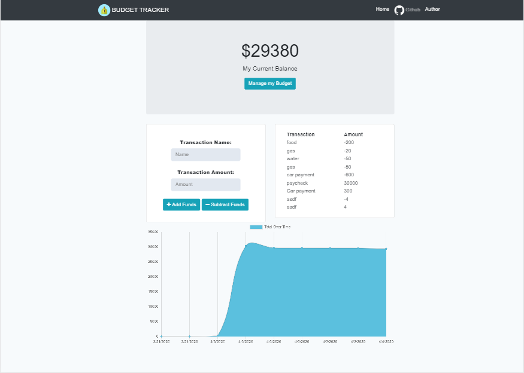

# Budget-Tracker



## Table of contents
- [General Info](#Info)
- [Install](#Install)
- [Dependencies](#Dependencies)
- [Technologies](#Technologies)
- [Demo](#Demo)
- [Author](#Author)
- [License](#License)

# General Info
- Using Progressive Web Application (PWA) this application enables the user to add expenses and deposits to their budget with or without an online connection. When entering transactions offline, data should populate the total when connected back online.


### User Story
AS AN avid traveller
I WANT to be able to track my withdrawals and deposits with or without a data/internet connection
SO THAT my account balance is accurate when I am traveling

### Business Context
Giving users a fast and easy way to track their money is important, but allowing them to access that information anytime is even more important. Having offline functionality is paramount to our applications success.

## Functionality 

Offline Functionality:
- Enter deposits offline
- Enter expenses offline

When brought back online:
- Offline entries should be added to tracker.

### Manifest ``` manifest.webmanifest ```
- #### Purpose
    - The manifest file is a simple text file (JSON file) that lists the resources the browser should cache for offline access. 
``` bash
{
    "short_name": "Budget-Tracker",
    "name": "Budget-Tracker",
    "icons": [
        {
            "src": "/img/icons/money.png",
            "sizes": "192x192",
            "type": "image/png"
        }
    ],
    "start_url": "/",
    "background_color": "#ffffff",
    "display": "standalone",
    "theme_color": "#ffffff"
}

```

This can be linked in the main html file ``` index.html ```
``` bash
<link rel="manifest" href="/manifest.webmanifest" />

```
### Service Worker  ``` service-worker.js ```
- #### Purpose
    - A Service Worker is basically a script that runs in background and assits in offline web application.  

``` bash 
console.log('This is your service-worker.js file!');

const FILES_TO_CACHE = [
    `/db.js`,
    `/index.html`,
    `/index.js`,
    `/index.css`,
    `/manifest.webmanifest`,
    `/img/icons/money.png`
];

const STATIC_CACHE = `static-cache-v1`;
const RUNTIME_CACHE = `runtime-cache`;

self.addEventListener(`install`, event => {
    event.waitUntil(
        caches
            .open(STATIC_CACHE)
            .then(cache => cache.addAll(FILES_TO_CACHE))
            .then(() => self.skipWaiting())
    );
});

self.addEventListener(`activate`, event => {
    const currentCaches = [STATIC_CACHE, RUNTIME_CACHE];
    event.waitUntil(
        caches
            .keys()
            .then(cacheNames =>
                // return array of cache names that are old to delete
                cacheNames.filter(cacheName => !currentCaches.includes(cacheName))
            )
            .then(cachesToDelete =>
                Promise.all(
                    cachesToDelete.map(cacheToDelete => caches.delete(cacheToDelete))
                )
            )
            .then(() => self.clients.claim())
    );
});

self.addEventListener(`fetch`, event => {
    if (
        event.request.method !== `GET` ||
        !event.request.url.startsWith(self.location.origin)
    ) {
        event.respondWith(fetch(event.request));
        return;
    }

    if (event.request.url.includes(`/api/transaction`)) {
        event.respondWith(
            caches.open(RUNTIME_CACHE).then(cache =>
                fetch(event.request)
                    .then(response => {
                        cache.put(event.request, response.clone());
                        return response;
                    })
                    .catch(() => caches.match(event.request))
            )
        );
        return;
    }

    event.respondWith(
        caches.match(event.request).then(cachedResponse => {
            if (cachedResponse) {
                return cachedResponse;
            }

            return caches
                .open(RUNTIME_CACHE)
                .then(cache =>
                    fetch(event.request).then(response =>
                        cache.put(event.request, response.clone()).then(() => response)
                    )
                );
        })
    );
});

```
- The service worker is registered/linked in the front end side (main html ``` index.html ``` ).

``` bash 
 <script>
            if ('serviceWorker' in navigator) {
                window.addEventListener('load', () =>
                    navigator.serviceWorker
                        .register('service-worker.js')
                        .then(reg => console.log('We found your service worker file!', reg))
                );
            }
</script>

```
# Install
```bash
npm i install

npm i express

npm i mongoose

```

### Run 
- 1. On your VS Code clone the <a href="https://github.com/Ethanlloyd21/Budget-Tracker" taget="_black"> gibthub repository</a>.
- 2. Install all dependencies (see above)
- 3. Create a terminal on the Budget-Tracker folder and run:
    ```` bash
    mongod
    ````
- 4. Create another terminal on the same folder and run:
    ``` bash
    node server
    ```

# Dependencies
``` bash
"dependencies": {
    "express": "^4.17.1",
    "install": "^0.13.0",
    "mongodb": "^3.5.5",
    "mongoose": "^5.9.7",
    "nodemon": "^2.0.2"
  }

```

# Technologies
- HTML5
- CSS
- jQuery
- Express
- MongoDB
- Mongoose
- IndexedDB
- Bootstrap

# Demo

# Author
- Lloyd Marcelino 
- github: https://github.com/ethanlloyd21
- website: lloydmarcelino.com
- email: lloydmarcelino@gmail.com

# License
- see MIT License Copyright (c) 2020
